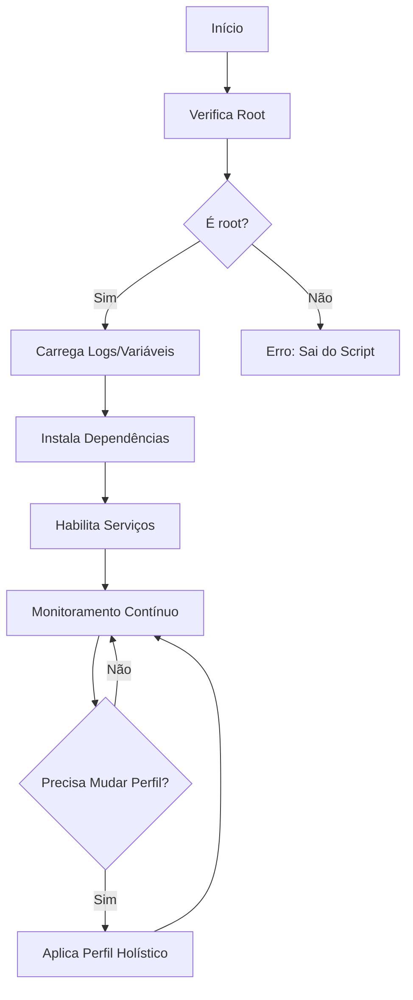
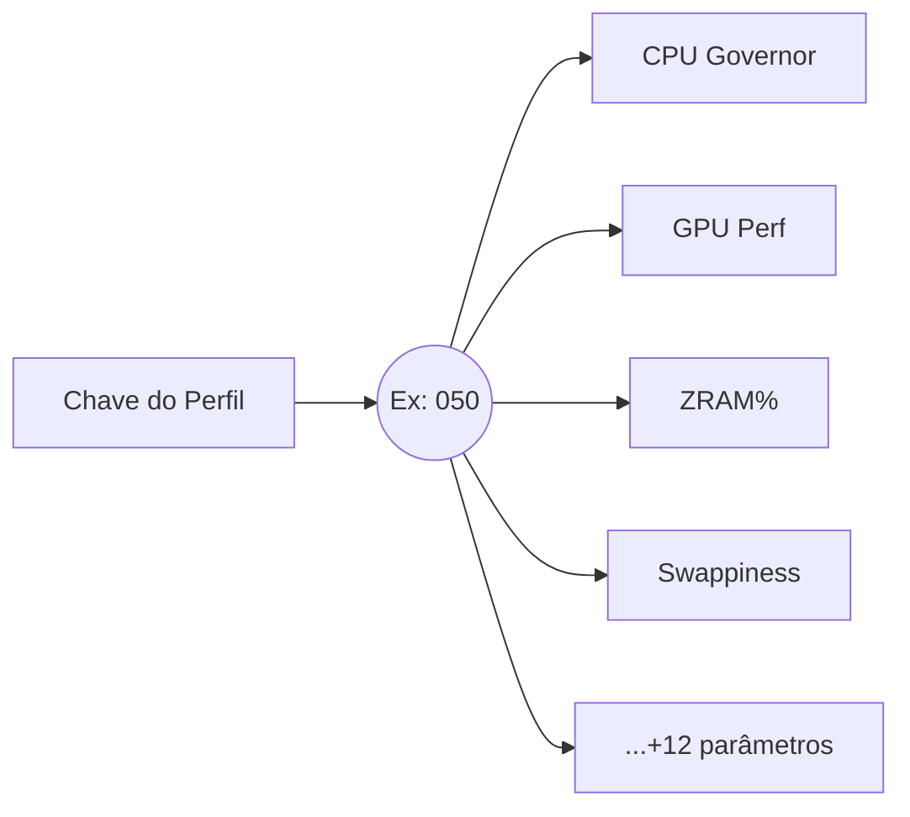
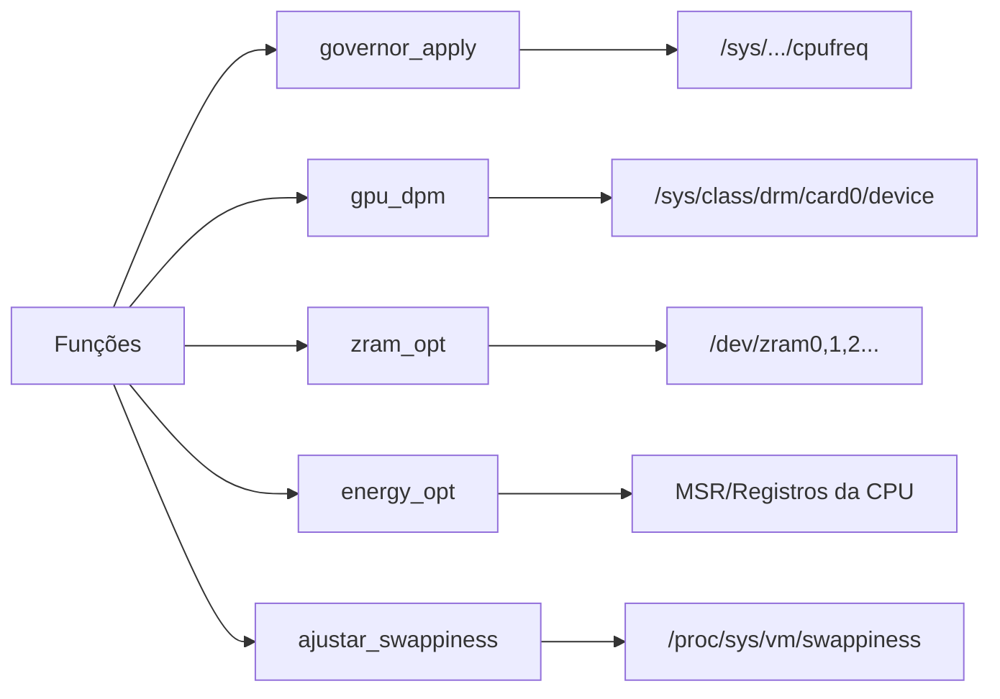
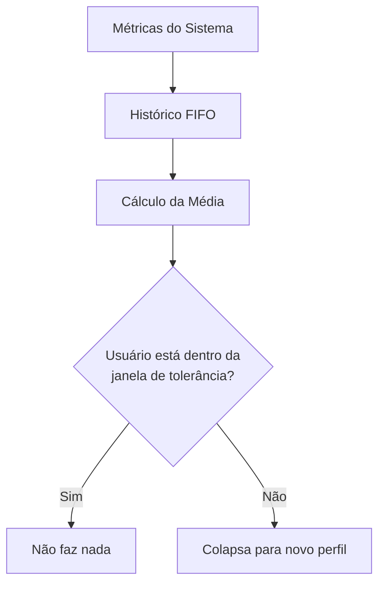
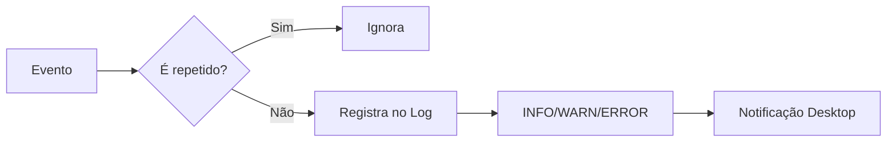
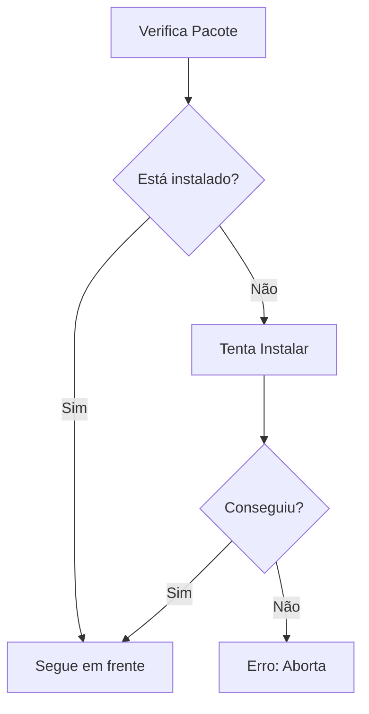
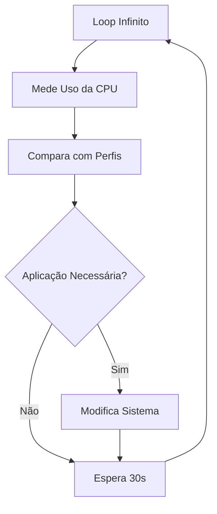

---

### 1. **Diagrama de Fluxo Principal**  

**Explicação Humana:**  
O script começa verificando se está rodando como root. Se sim, instala dependências, liga serviços como TLP e thermald, e entra num loop infinito de monitoramento. A cada 30s, decide se precisa mudar o perfil de energia com base no uso do sistema.

---

### 2. **Estrutura dos Perfis Holísticos**  

**Explicação Humana:**  
Cada perfil (como "050") é uma combinação pré-definida de configurações que afetam CPU, GPU, memória, etc. É uma "receita de bolo" para balancear desempenho e energia.

---

### 3. **Funções Nucleares**  

**Explicação Humana:**  
Cada função mexe em um subsistema diferente do Linux. Por exemplo, `governor_apply` altera governadores da CPU escrevendo em `/sys`, enquanto `zram_opt` cria dispositivos de swap na RAM.

---

### 4. **Máquina Bayesiana (faz_o_urro)**  

**Explicação Humana:**  
O script guarda um histórico das últimas medições de uso da CPU. Se o uso atual fugir da média (ex: ±5%), ele muda de perfil. É um "filtro" para evitar mudanças bruscas por oscilações momentâneas.

---

### 5. **Sistema de Logs e Erros**  

**Explicação Humana:**  
O log evita spam repetindo a mesma mensagem. Erros graves (como falta de permissão) disparam notificações no desktop (se disponível).

---

### 6. **Gerenciador de Dependências**  

**Explicação Humana:**  
O script checa se ferramentas como `tlp` ou `lm-sensors` estão instaladas. Se faltar algo, tenta instalar via `apt-get`. Se falhar, o script morre.

---

### 7. **Visão Geral do Motor de Decisão**  

**Explicação Humana:**  
O coração do script é um loop que verifica constantemente se o sistema está dentro dos parâmetros desejados. Se não estiver, dispara as mudanças necessárias.
